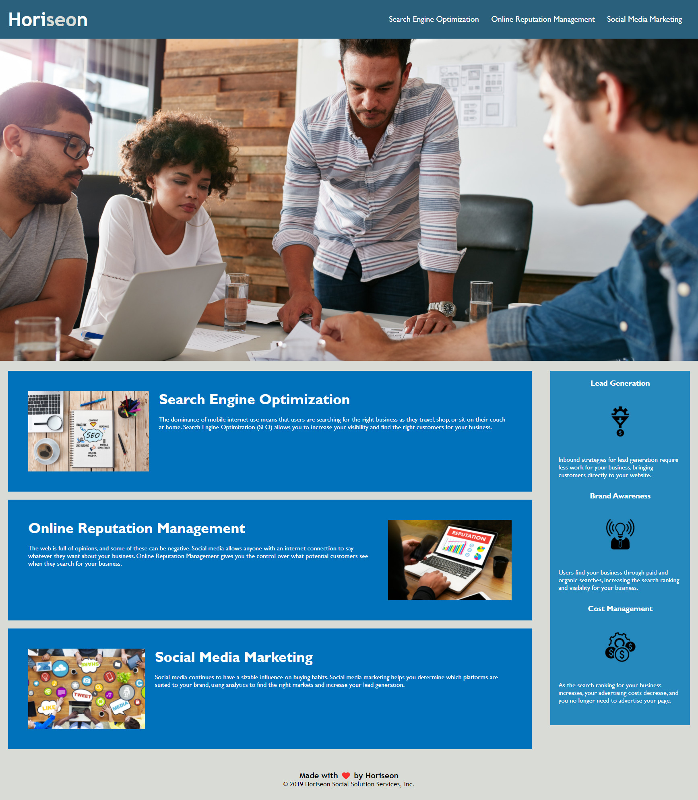

# HORISEON - Week 1 Challenge

## About This Project

This is the landing page of Horiseon, a digital project management and marketing firm.  So far the site consists of just this page, and it outlines the services that Horiseon provides.  The links at the top of the page direct the user to anchor elements further down the page.

Horiseon have tasked me with making their website more accessible.  The website that they have already is fully functional, but there are some problems with the code - these include a lack of image descriptions, lack of semantic HTML, and repetition within the stylesheet.

Although the site is fully operational, the above noted problems will cause issues for users with accessibility needs, and have bloated the stylesheet to make it overly complicated and therefore inefficient.

To fix these issues I implemented the following changes to the HTML and CSS:
* Removed all div tags and replaced them with more descriptive HTML tags, adhering to semantic HTML practices, and updating the CSS rules accordingly
* Added comments to the HTML and CSS to make the project more manageable
* Added alt tags with image descriptions
* Consolidated CSS rules, and re-ordered them to keep section rules together
* Changed the footer heading to h4 for correct heading flow

---
## How the Project Should Appear
Below is an image of the completed website after all changes have been made.

---
## Links
[Project Code on Github](https://github.com/philmcgarty/horiseon "Github")

[Deployed Site](https://philmcgarty.github.io/horiseon)